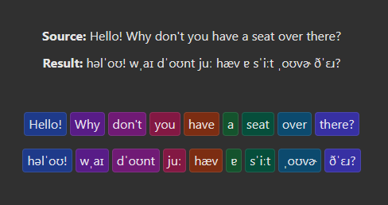
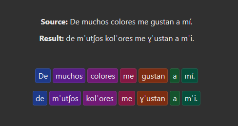
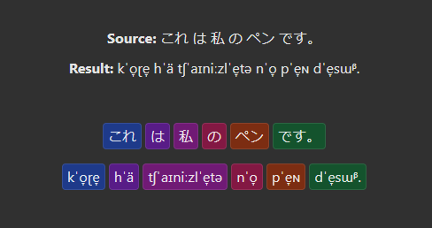
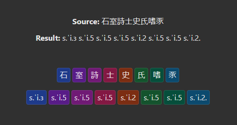

# ephone - eSpeak NG phoneme generation

This package contains just the phoneme generation from [espeak-ng](https://github.com/espeak-ng/espeak-ng), compiled to wasm via emscripten. The main reason I created this instead of just using the existing phonemizer package, is that this one provides a map between the individual parts of the source text and the output IPA. Or, if you don't need that, it can just generate IPA ([International Phonetic Alphabet](https://wikipedia.org/wiki/International_Phonetic_Alphabet)) too.

Other features include multi-language support and a much smaller package size (depending on which languages you select). If using only the default en-US, it gzips down to 375KB. See [languages](#languages) for more.

## Usage examples

### Simple English:

```javascript
import createEphone from 'ephone';
const ephone = await createEphone();
ephone.textToIpa('Hello!');

> "həlˈoʊ!"
```

### English with source map:

```javascript
import createEphone from 'ephone';

document.getElementById('app').innerHTML = `<div>
    <div>Source: <span id="source-text" /></div>
    <div>Result: <span id="result-ipa" /></div>
    <div id="source-spans" />
    <div id="ipa-spans" />
  </div>`;

const appendColorSpan = (text, color, id) => {
  const span = document.createElement('span');
  span.textContent = text;
  span.style.backgroundColor = color;
  document.getElementById(id).append(span);
};

const ephone = await createEphone();
const result = ephone.textToIpaWithSourceMap("Hello! Why don't you have a seat over there?");

document.getElementById('source-text').textContent = result.text;
document.getElementById('result-ipa').textContent = result.ipa;

for (const [source, ipa] of result.asSpans()) {
  const color = colors.shift();
  appendColorSpan(source, color, 'source-spans');
  appendColorSpan(ipa, color, 'ipa-spans');
}
```

<!--  -->


### Other languages:

By default, only the data necessary for American English are loaded. To use a different language (or multiple languages), first import its language pack, then use it to initialize the ephone module. This way, any modern javascript bundler should be smart enough to deliver only the files you actually use.

```javascript
import createEphone, { roa } from 'ephone'; // roa = Romance family

const ephone = await createEphone(roa);
ephone.setVoice('es'); // 'es' is the first language in roa, so this doesn't actually change anything
const result = ephone.textToIpaWithSourceMap('De muchos colores me gustan a mí.');
```

<!--  -->


### Multiple languages and caveats:

It's a similar story for loading multiple languages. Notice that some languages may be less functional than others. For example, the Japanese "私" produces "tʃˈaɪniːzlˈe̞tə", or... 🤦‍♂️ "chinese letter". Also, spaces are needed between the Japanese words to produce a proper mapping. And in the Chinese example, the tones are indicated by number. It may be possible to change this, I have not looked into it deeply.

```javascript
import createEphone, { jpx, sit } from 'ephone'; // sit = Sino-Tibetan family

const ephone = await createEphone([jpx, sit]);

ephone.setVoice('ja');
result = ephone.textToIpaWithSourceMap('これ は 私 の ペン です。');

ephone.setVoice('cmn');
result = ephone.textToIpaWithSourceMap('石室詩士史氏嗜豕');
```

<!--   -->

 

### Listing voices:

```javascript
import createEphone, { en_all, roa, gmw } from 'ephone';
const ephone = await createEphone([en_all, roa, gmw]);
ephone.getVoices()

> [
    { name: "en",     desc: "English (Great Britain)" },
    { name: "en-US",  desc: "English (America)" },
    { name: "es",     desc: "Spanish (Spain)" },
    { name: "es-419", desc: "Spanish (Latin America)" },
    { name: "fr",     desc: "French (France)" },
    ...
  ]
```

## Languages

I built this with a handful of language packs. The packs are implemented as ES6 modules, so as mentioned above, javascript bundlers should be capable of recognizing which are used in your code and only ship the needed files. Here's a list of what is available:

| Module   | Name             | Description                          |
| -------- | ---------------- | ------------------------------------ |
| `en_us`  | `en-US`          | English (America)                    |
| `en_all` | `en`             | English (Great Britain)              |
|          | `en-029`         | English (Caribbean)                  |
|          | `en-GB-scotland` | English (Scotland)                   |
|          | `en-GB-x-gbclan` | English (Lancaster)                  |
|          | `en-GB-x-gbcwmd` | English (West Midlands)              |
|          | `en-GB-x-rp`     | English (Received Pronunciation)     |
|          | `en-US`          | English (America)                    |
| `roa`    | `es`             | Spanish (Spain)                      |
|          | `es-419`         | Spanish (Latin America)              |
|          | `fr`             | French (France)                      |
|          | `it`             | Italian                              |
|          | `pt`             | Portuguese (Portugal)                |
|          | `pt-BR`          | Portuguese (Brazil)                  |
| `gmw`    | `de`             | German                               |
|          | `nl`             | Dutch                                |
| `sit`    | `cmn`            | Chinese (Mandarin, latin as English) |
|          | `yue`            | Chinese (Cantonese)                  |
| `jpx`    | `ja`             | Japanese                             |
| `zlx`    | `ru`             | Russian                              |
|          | `uk`             | Ukrainian                            |
|          | `pl`             | Polish                               |

There's also one more module: `all`, which contains every language from eSpeak NG. Check out the full list at the [parent project](https://github.com/espeak-ng/espeak-ng/blob/HEAD/docs/languages.md). This is a pretty large file at 18MB, or 14MB gzipped. The size may not be a problem for some projects, but if you just need one or two specific languages, it's not too hard to build your own. Check out the build scripts on github.

## License Information

[GPL version 3](https://github.com/sjmik/ephone-js/blob/HEAD/COPYING) is inherited from [eSpeak NG Text-to-Speech](https://github.com/espeak-ng/espeak-ng).
Complete change history is available via github.
